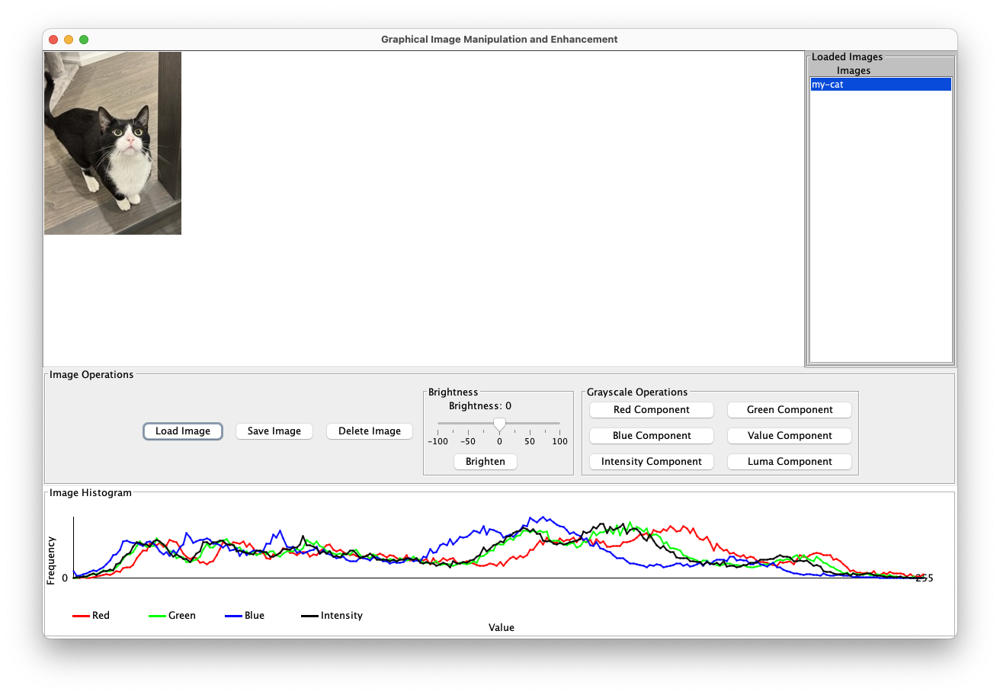

# Image Editing Program

![NOTE]
>Read the **USEME.md** file for instructions on how to use the program. 

## Photo citations
`my_cat.ppm`: This is my own photo taken on May 10, 2024.

---

## Project Summary

**Image Editing Program** is a Java-based image manipulation application developed as a final project for CS5008: Object Oriented Design. The program allows users to convert and save images by manipulating greyscales and brightness levels, supporting both PPM and standard image formats (JPEG, PNG, BMP). The application features both command-line and GUI interfaces, and is thoroughly tested using JUnit4.

---

## Architecture & Design

The project follows **SOLID principles** and implements the **MVC (Model-View-Controller) architecture pattern** with the **Strategy** and **Command** design patterns.

### Key Components

#### Model

- **`IImage`** interface: Builds images pixel by pixel with RGB components stored in a single array for memory efficiency
- **`getPixelIndex`**: Helper method for retrieving correct RGB values at specific coordinates
- **`setPixel`**: Creates new images with modifications
- **`getPixel`**: Retrieves RGB values as an integer array
- Validates that width, height, and maxValues are positive

#### Operations (Strategy Pattern)

- **`IOperation`** interface for image manipulation
- **Greyscale operations** based on: red, green, blue, intensity, value, and luma components
- **Brightness operations**: brighten/darken functionality
- **`AbstractGreyScale`**: Abstract class for shared greyscale logic
- All operations include null checks and value range validation (0-255)

#### View

- **Read/Write interfaces** for file and object I/O
- **`PPMReader`**: Reads PPM files and creates `IImage` objects
- **`PPMWriter`**: Writes `IImage` objects to files
- **`StandardImageReader/Writer`**: Handles JPEG, PNG, and BMP formats
- Separated implementation for different image types (separation of concerns)

#### Controller (Command Pattern)

- **`IImageController`**: Interface with single `run()` operation
- **Command classes**:
  - **`ICommand`**: Base interface for all commands
  - **`BrightenCommand`**: Adjusts brightness (positive/negative values)
  - **`AbstractGreyScale`**: Base for greyscale commands
  - **Greyscale commands**: `RedGreyScaleCommand`, `GreenGreyScaleCommand`, `BlueGreyScaleCommand`, `ValueGreyScaleCommand`, `IntensityGreyScaleCommand`, `LumaGreyScaleCommand`
- Features: supports comments (#), ignores empty lines, detailed error messages
- Works with any Readable input and Appendable output

#### Storage

- **`IImageStorage`** interface: Manages image database using HashMap (name → IImage)
- **`IImageStorageImpl`**: Implementation with methods:
  - `addImage()`: Adds new image (fails if name exists)
  - `putImage()`: Adds or overwrites image
  - `getImage()`: Retrieves image by name
  - `hasImage()`: Checks existence
  - `getAllImages()`: Returns unmodifiable view
  - `removeImage()`: Deletes images from database

#### GUI Features (Java Swing)

- **`GUIView`**: Main GUI class extending JFrame with:
  - **Image Display Panel**: Center panel with scrolling for large images
  - **Image List Panel**: Right-side scrollable list of all loaded images
  - **Control Panels**: Bottom panels for Load/Save/Delete operations, brightness slider, and greyscale buttons
  - **Histogram Panel**: Real-time display of red, green, blue, and intensity components as line charts
- **`ImageGUIController`**: Implements `ImageViewListener` and `IImageController` for high-level event handling
- **`ImageHistogramImpl`**: Computes and stores histogram data for all color components
- **`HistogramPanel`**: Custom panel that automatically updates with image changes

---

## Main Execution

**`ProcessImage`** - Main entry point with three modes:

1. **Script file mode**: `java ProcessImage mycommands.txt` or `java ProcessImage -file mycommands.txt`
2. **Interactive console mode**: Run and enter commands manually (quit with `quit`, `exit`, or `q`)
3. **GUI mode**: Launch graphical interface with drag-and-drop functionality

---

## Features

- Multiple greyscale transformations (red, green, blue, intensity, value, luma)
- Brightness adjustment with positive/negative values
- Support for PPM, JPEG, PNG, and BMP formats
- Command-line and graphical user interfaces
- Real-time histogram visualization
- Image database with multiple image management
- Comprehensive error handling and validation
- JUnit4 test coverage
